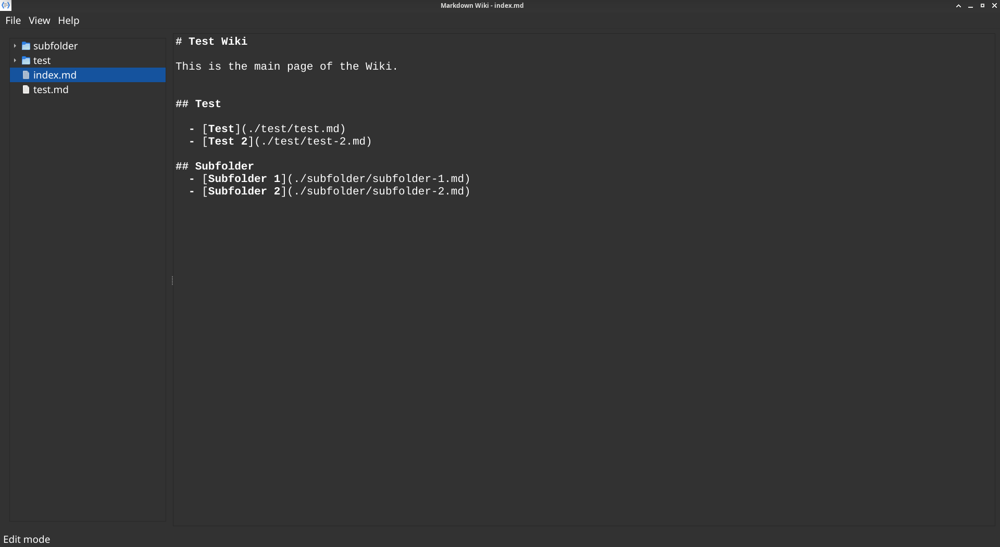

# Markdown Wiki

Markdown Wiki is a desktop application to write Markdown based wikis. It is somehow inspired in [vimwiki](https://vimwiki.github.io/) and the
goal is to be a simple offline tool to quickly create, link, edit and visualize Markdown Files.

## Main Features

Markdown Wiki aims to be a feature complete application with a concrete list of features:

  - **File Navigation:** Easily navigate trhough a Wiki folder to create, delete, rename files.
  - **Markdown Editor:** A text editor to edit Markdown Files.
  - **Preview:** Quickly toogle between edit/preview to see your rendered file.

Once all features are complete, the application will be considered done and only bugfixes and maintainance will be done.

## TODO
  - [x] Handle folder creation/deletion.
  - [x] Paste without formating.
  - [ ] When toogling view, keep the position of the cursor.
  - [ ] When deleting a file, clean the QTextView.
  - [x] Basic Syntax Highlight that works with light/dark themes.
  - [ ] Improve render QSS style for better readability.

## Development

MarkdownWiki is written in Python 3.13 using [Qt for Python](https://doc.qt.io/qtforpython-6/) and the project is using [uv](https://docs.astral.sh/uv/) to handle environments, dependencies and versions.

## Contributing

- Fork it (https://github.com/pdelboca/markdownwiki/fork)
- Create your feature branch (git checkout -b my-new-feature)
- Commit your changes (git commit -am 'Add some feature')
- Push to the branch (git push origin my-new-feature)
- Create a new Pull Request

